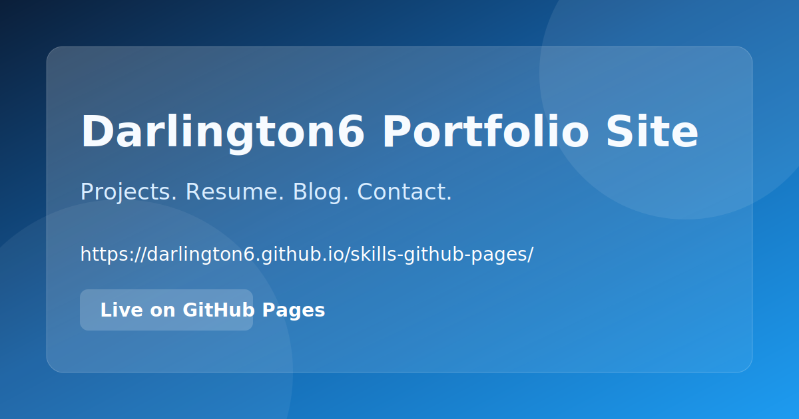

# Darlington6 Portfolio Site

[](https://darlington6.github.io/skills-github-pages/)

Personal portfolio website built with Jekyll and hosted on GitHub Pages.

Live site: https://darlington6.github.io/skills-github-pages/

## Preview

Open the live site here:

- https://darlington6.github.io/skills-github-pages/

## What is included

- Home page
- About page
- Projects page
- Resume page
- Contact page
- Blog index and posts

## Tech stack

- Jekyll
- GitHub Pages (`github-pages` gem)
- Markdown content

## Run locally

Prerequisites:

- Ruby `3.2.4`
- Bundler

Install dependencies and run:

```bash
bundle install
bundle exec jekyll serve
```

Then open:

- http://127.0.0.1:4000/skills-github-pages/

## Project structure

- `_config.yml`: Site configuration
- `_layouts/`: Page and post layouts
- `_includes/`: Shared partials
- `_posts/`: Blog posts
- `index.md` and top-level `.md` files: Main site pages

## Deployment

This site is deployed with GitHub Pages from this repository.

## License

This project is licensed under the MIT License. See `LICENSE`.
